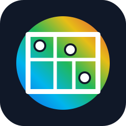

<p align="center">
  
</p>

<h1 align="center">Home Assistant Heatmap Card</h1>

<p align="center">
  A Lovelace floorplan card with real-time IDW temperature heatmaps.
</p>

Render IDW (Inverse Distance Weighting) heatmaps over a floorplan image. Sensor temperatures are interpolated across the image and painted through `OffscreenCanvas` for non-blocking recalculation.

## Installation

### HACS

1. In **HACS → Frontend**, open the overflow menu and select **Custom repositories**.
2. Add `https://github.com/gira0/ha-heatmap` with category **Dashboard**.
3. Find and install **ha-heatmap-card**.
4. Add the resource to your Lovelace configuration if HACS does not register it automatically.

### Manual

1. Copy `dist/ha-heatmap-card.js` to `<config>/www/ha-heatmap-card.js`.
2. Add the resource in your Lovelace dashboard settings:
   ```yaml
   url: /local/ha-heatmap-card.js
   type: module
   ```

## Configuration

### Visual editor

Use the dashboard's **Edit card** action to configure the card without writing YAML. The visual editor lets you search and add `sensor` entities, set their initial coordinates, remove sensors, and change the heatmap settings. Enable **Calibration Mode** there to drag targets directly over the floorplan, then use **Copy YAML** to preserve the calibrated coordinates.

If no floorplan image is configured, the card displays a bundled sample floorplan. It is intended as an editor placeholder; set `background_image` to use your own image.

```yaml
type: custom:ha-heatmap-card
background_image: /local/floorplan.png
temperature_scale: auto
scale_padding: 2
min_span: 6
clamp_min: 15
clamp_max: 35
power: 2
resolution_scale: 0.5
opacity: 0.7
entities:
  - entity_id: sensor.living_room_temperature
    x: 0.30
    y: 0.55
  - entity_id: sensor.bedroom_temperature
    x: 0.72
    y: 0.20
  - entity_id: sensor.kitchen_temperature
    x: 0.15
    y: 0.80
```

### Options

| Key | Type | Required | Description |
|---|---|---|---|
| `background_image` | `string` | yes | Path to the floorplan image (relative to HA `www/`). |
| `entities` | `list` | yes | List of sensor entities with their coordinates. |
| `entities[].entity_id` | `string` | yes | HA entity ID of a temperature sensor. |
| `entities[].x` | `float` | yes | Normalised horizontal position on the image (0.0 – 1.0). |
| `entities[].y` | `float` | yes | Normalised vertical position on the image (0.0 – 1.0). |
| `temperature_scale` | `fixed` / `auto` / `percentile` | no | `fixed` uses `min_value` / `max_value` (default). `auto` uses all current valid sensors. `percentile` reduces the influence of extremes. |
| `min_value` | `float` | no | Value mapped to the cold end of the gradient (default `18`). |
| `max_value` | `float` | no | Value mapped to the hot end of the gradient (default `27`). |
| `scale_padding` | `float` | no | In auto mode, degrees added below and above the current sensor range (default `2`). |
| `min_span` | `float` | no | In auto mode, minimum total range in degrees to prevent exaggerated contrast (default `6`). |
| `lower_percentile` | `float` | no | In percentile mode, low-end percentile from `0`–`100` (default `10`). |
| `upper_percentile` | `float` | no | In percentile mode, high-end percentile from `0`–`100` (default `90`). |
| `clamp_min` | `float` | no | Optional lower safety limit for an automatic range. |
| `clamp_max` | `float` | no | Optional upper safety limit for an automatic range. |
| `power` | `float` | no | IDW distance-decay exponent (default `2`). Higher values create sharper transitions around sensors. |
| `resolution_scale` | `float` | no | Downsample factor for the heatmap grid (default `1.0`). Lower values improve performance at the cost of resolution. |
| `opacity` | `float` | no | Heatmap overlay opacity from `0.0` (transparent) to `1.0` (opaque), default `0.7`. |
| `marker_size` | `float` | no | Minimum radius of each sensor marker in displayed pixels (default `16`, allowed range `8`–`48`). Markers automatically grow to fit decimal values. |
| `marker_shape` | `box` / `circle` | no | Marker style. `box` is the default and expands naturally for the label; `circle` keeps the original circular marker. |
| `edit_mode` | `boolean` | no | Show draggable calibration targets and a button to copy the updated YAML (default `false`). |

Each configured sensor is shown as a white boxed marker labelled with its current numeric value. Set `marker_shape: circle` to use round markers instead.

### Automatic temperature scale

For a relative view of the warmest and coolest rooms, set `temperature_scale: auto`. The card calculates its colour range from the current valid sensor readings, adds `scale_padding`, then enforces `min_span`. For example, readings from $26.9^\circ$ to $28.6^\circ$ with the defaults yield an active range of $24.75^\circ$ to $30.75^\circ$.

Use `clamp_min` and `clamp_max` to prevent implausible sensor readings from expanding the scale too far. Keep `temperature_scale: fixed` when colours should always represent absolute temperature thresholds.

Use `temperature_scale: percentile` when a sensor occasionally reports an extreme temperature. It calculates the range from `lower_percentile` and `upper_percentile` rather than directly using the coldest and warmest readings. For example, set both to `25` and `75` to focus the scale on the middle half of readings, while still applying padding, minimum span, and optional clamps.

### Position calibration

Set `edit_mode: true` temporarily to show a labelled blue draggable target for every configured sensor. The label uses the Home Assistant friendly name and current value when available. Drag each target to the real sensor location, then select **Copy YAML** and replace the card configuration with the copied result. The card cannot modify Lovelace configuration automatically.

```yaml
type: custom:ha-heatmap-card
edit_mode: true
background_image: /local/floorplan.png
entities:
  - entity_id: sensor.living_room_temperature
    x: 0.30
    y: 0.55
```

Remove `edit_mode: true` once the positions are saved to hide the calibration controls.

## Color Scale

The heatmap uses this fixed RGB gradient:

| Relative value | Color |
|---|---|
| Minimum | Blue `[0, 0, 255]` |
| 25% | Cyan `[0, 255, 255]` |
| Mid-range | Green `[0, 255, 0]` |
| 65% | Yellow `[255, 255, 0]` |
| Maximum | Red `[255, 0, 0]` |

Values outside this range are clamped to the nearest endpoint.

## Disclaimer

This is a vibe-coded project built with AI assistance. It is provided as an experimental community project; review the code and test it in your own Home Assistant environment before relying on it for important automations. It is not affiliated with, endorsed by, or supported by Home Assistant.
